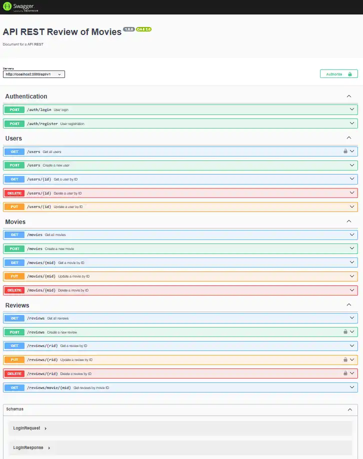

# Hito_Node.js_API_Sequelize

Proyecto educativo básico "Creación de un servidor" con node, express y sequelize

API de Review y Rating de peliculas (IMDb y Rotten Tomatoes) 

ESTA ES LA CONTINUACIÓN DEL REPOSITORIO: https://github.com/DiegoGonzalezBaeza/Hito-2-Backend_Node_y_Express


RECORDAR: que la aplicación de docker debe estar abierta.

### Comandos Docker

```bash
docker compose up -d # Inicia los contenedores en segundo plano
docker compose stop # Detiene los contenedores
docker compose down # Detiene y elimina los contenedores
dokcer compose logs db # Muestra los logs del contenedor db
```

# 1.- Instalar sequelize y pg-hstore:

```bash
npm install --save-dev @types/node @types/validator
npm install sequelize reflect-metadata sequelize-typescript

npm install --save pg pg-hstore
```

# 2.- Modificar tsconfig.json o crear uno nuevo:

```json
{
  "compilerOptions": {
    "target": "es6", // or a more recent ecmascript version
    "experimentalDecorators": true,
    "emitDecoratorMetadata": true
  }
}
```
para crear un nuevo tsconfig.json:

```bash
npx tsc --init
```

pero se deben activar "experimentalDecorators": true,  y "emitDecoratorMetadata": true

# 3.- Nuevo Modelo.ts

```ts
import {
  AllowNull,
  Column,
  DataType,
  Default,
  IsEmail,
  IsUUID,
  Model,
  PrimaryKey,
  Table,
  Unique,
} from "sequelize-typescript";

interface UserAttributes {
  uid?: string;
  email: string;
  password:string;
}

@Table({
  tableName: "users",
})
export class User extends Model<UserAttributes> {
  @IsUUID(4)
  @PrimaryKey
  @Default(DataType.UUIDV4)
  @Column(DataType.UUID)
  declare uid: string;

  @AllowNull(false)
  @IsEmail
  @Unique
  @Column(DataType.STRING)
  declare email: string;

  @AllowNull(false)
  @Column(DataType.STRING)
  declare password: string;
}
```

# 3.- funciones de sequelize para el service.ts

```ts
findByPk()// READ -- POR ATRIBUTO PRIMARY KEY
findOne() // READ -- POR ATRIBUTO ESPECIFICO
create()  // CREATE
save()    // UPDATE
destroy() // DELETE
```
# 4.- Ingreso de datos: 

## - Users
```json
{
  "email": "user@example.com",
  "password": "string"
}
```

## - Movies
```json
{
  "title": "movie1",
  "release_year": 1990,
  "director": "Nolan",
  "duration_minutes": 150,
  "synopsis": "todo o nada",
  "poster_url": "ww_ww_WW"
}
```
```json
{
  "mid": "06277e68-dc6a-438c-8071-b7b23b2e68b7",
  "title": "movie1",
  "release_year": 1990,
  "director": "Nolan",
  "duration_minutes": 150,
  "synopsis": "todo o nada",
  "poster_url": "ww_ww_WW",
  "updatedAt": "2025-01-16T05:07:50.626Z",
  "createdAt": "2025-01-16T05:07:50.626Z"
}
```

## - Reviews
```json
{
  "uid": "b52c18e9-41aa-4989-85cb-a2f4f862c2c0",
  "mid": "f0bb2d60-ec84-4101-81d9-7ae88b901b2e",
  "rating": 4,
  "review_text": "Buena pelicula, pero algo lenta"
}
```
```json
{
  "rid": "97401c4b-681f-444e-b7e7-f4e98ac6d904",
  "rating": 4,
  "review_text": "Buena pelicula, pero algo lenta",
  "created_at": "2025-01-16T05:42:22.725Z",
  "updated_at": "2025-01-16T05:42:22.725Z",
  "uid": "b52c18e9-41aa-4989-85cb-a2f4f862c2c0",
  "mid": "f0bb2d60-ec84-4101-81d9-7ae88b901b2e"
}
```
## - Register


## - Login


## - Get all Users


## - Update User


## - Delete User


## - Swagger


## - All CRUD - User - Movie - Review (swagger)
.jpeg)